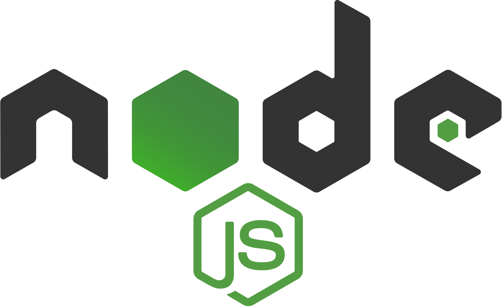
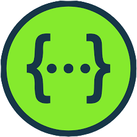

<h1>Admin Panel API</h1>
<p>Using the Admin Panel API you can add / modify / read / delete companies and their employees</p>

---

#

## Table of Contents

- [Table of Contents](#table-of-contents)
- [Prerequisites](#prerequisites)
- [Tech Stack](#tech-stack)
- [Getting Started](#getting-started)
- [Project Structure](#project-structure)
- [Resources](#resources)

## Prerequisites

-  _Node JS @12.X and up_
-  _npm @6 and up_

#

## Tech Stack

-  [NodeJS @16.15.1](https://nodejs.org/en/) - JavaScript runtime built on Chrome's V8 JavaScript engine
-  [Express @4.18.1](https://expressjs.com/) - Fast, unopinionated, minimalist web framework for Node.js
-  [MongoDB](https://www.mongodb.com/) - Open source NoSQL database management program
-  [mongoose @6.3.6](https://mongoosejs.com/) - elegant mongodb object modeling for node.js
-  [express-validator @6.14.1](https://express-validator.github.io/docs/) - Set of express.js middlewares that wraps validator.js validator and sanitizer functions
-  [JSON Web Token @8.5.1](https://jwt.io/) - Industry standard RFC 7519 method for representing claims securely between two parties
-  [Swagger UI Express @4.4.0](https://www.npmjs.com/package/swagger-ui-express) - Allows you to serve auto-generated swagger-ui generated API docs from express

#

## Getting Started

1\. First of all you need to clone repository from github:

```sh
git clone https://github.com/RedberryInternship/company-employees-api-Var-Saba.git
```

2\. Next step requires install all the dependencies

```sh
npm install
```

or

```sh
yarn install
```

3\. Copy .env

```sh
cp .env.example .env
```

4\. If you want you can also change default configuration of .env file and connect to mongodb

```sh
MONGO_DATABASE=adminPanel
MONGO_HOST=localhost
MONGO_PORT=27017

SERVER_PORT=3000

ACCESS_TOKEN_SECRET=secret-text

USER_PASSWORD=***
USER_EMAIL=***
```

5\. after that you can run Admin Panel API from terminal:

```sh
npm run dev
```

6\. To create new user from the terminal run the following command:

```sh
npm run user:create
```

To see swagger documentation visit [localhost:3000/api-docs/](http://localhost:3000/api-docs/)

#

#

## Project Structure

```bash
├─── readme
├─── src
│    ├── bin
│    ├── config
│    ├── controllers
│    ├── middlewares
│    ├── models
│    ├── routes
│    └── schemas
- .env
- .eslintrc.json
- .gitignore
- .prettierrc.json
- package.json
- README.md


```

#

## Resources

- [Application Details](https://redberry.gitbook.io/assignment-iii-admin-panel-api/)
- [Git commit rules](https://redberry.gitbook.io/resources/git-is-semantikuri-komitebi)
